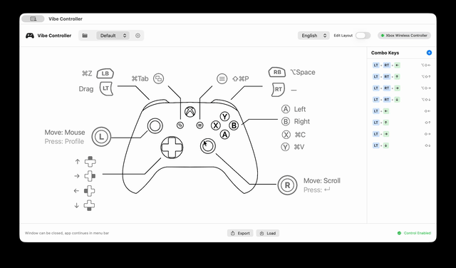

# Vibe Controller

**[简体中文](README_zh-CN.md)** | **[繁體中文](README_zh-TW.md)** | **[日本語](README_ja.md)**

## Features

- **Menu Bar App** - Runs in background after closing window
- **Visual Button Map** - Intuitive display of current button mappings
- **Background Operation** - IOKit HID based, works even when window loses focus
- **App Switcher** - Hold Back button to switch apps like Cmd+Tab
- **Profile Wheel** - Press L3 to quickly switch between profiles
- **Auto Profile Switch** - Automatically switch profile when app changes
- **App Exposé Mode** - Navigate windows using D-Pad
- **Customizable Mappings** - Configure any button to any action

## Quick Start

### Option 1: Download Release

Download the latest release from [GitHub Releases](https://github.com/bobmayuze/vibeController/releases/tag/alpha)

### Option 2: Run with Xcode

1. Open `VibeController.xcodeproj`
2. Press Cmd+R to run
3. Grant Accessibility permission on first launch

## Default Button Mappings

| Controller | Function |
|------------|----------|
| **Left Stick** | Mouse movement |
| **Right Stick** | Scroll |
| **A** | Left click |
| **B** | Right click |
| **X** | Copy (⌘C) |
| **Y** | Paste (⌘V) |
| **LB** | Undo (⌘Z) / Previous app in App Switcher |
| **RB** | Option+Space / Next app in App Switcher |
| **LT** | Drag mode (hold to drag files/text) |
| **RT** | Enter |
| **L3** | Profile Wheel |
| **R3** | Esc |
| **Start** | Command Palette (⌘⇧P) |
| **Back** | App Switcher (⌘Tab) |
| **D-Pad Up/Down** | Arrow keys |
| **D-Pad Left/Right** | Option + Arrow keys (word navigation) |

### Chord Mappings (Combos)

| Combo | Function |
|-------|----------|
| **LT + D-Pad** | Shift + Arrow keys (text selection) |

## App Switcher Usage

1. **Hold Back** → Open app switcher
2. **Hold Back + RB** → Next app
3. **Hold Back + LB** → Previous app
4. **Release Back** → Confirm selection

## Auto Profile Switch

Automatically switch profiles based on the active app:

1. Enable "Auto Switch Profile" in settings
2. Click "Manage Associated Apps" for a profile
3. Select apps to associate with that profile
4. Set a default profile for apps without associations

When you switch to an associated app, the profile changes automatically with a notification overlay.

## Permissions

First launch requires Accessibility permission:

**System Settings → Privacy & Security → Accessibility → Allow Vibe Controller**

## Tech Stack

- **Swift + SwiftUI** - Native macOS app
- **IOKit HID** - Direct controller input, supports background operation
- **CoreGraphics** - Mouse and keyboard simulation
- **MenuBarExtra** - Menu bar integration

## Recommended Tools

For voice input while using Vibe Controller, I recommend [Handy](https://github.com/cjpais/Handy) - a free, open source, and privacy-focused speech-to-text application that works completely offline.

## License

MIT License © 2026 [Yuze Ma](mailto:yuze.bob.ma@gmail.com)

See [LICENSE](LICENSE) for details.
